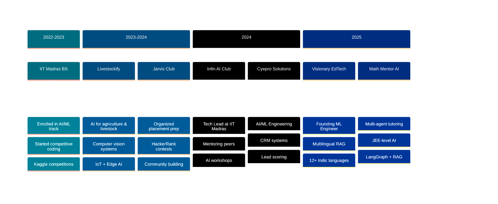

<div align="center">

<!-- Epic Animated Header -->


<!-- Animated Name -->
<h1>
  
</h1>

<!-- Coding Animation GIF -->


<!-- Subtitle -->
<h3>
  
  Building Intelligent Systems That Scale Across Languages & Domains
  
</h3>

<!-- Multi-line Typing Effect -->
<a href="https://git.io/typing-svg">
  
</a>

<br>

<!-- Quick Access Buttons -->
<p>
  <a href="mailto:ruthvikworking@gmail.com">
    
  </a>
  <a href="https://www.linkedin.com/in/sai-ruthvik">
    
  </a>
  <a href="https://www.leetcode.com/saifromiitm">
    
  </a>
</p>

<!-- Social Links Table -->
<table>
<tr>
<td align="center" width="20%">
  <a href="https://www.linkedin.com/in/sai-ruthvik">
    
  </a>
</td>
<td align="center" width="20%">
  <a href="https://github.com/hawkh">
    
  </a>
</td>
<td align="center" width="20%">
  <a href="https://kaggle.com/hawkh">
    
  </a>
</td>
<td align="center" width="20%">
  <a href="https://www.leetcode.com/saifromiitm">
    
  </a>
</td>
<td align="center" width="20%">
  <a href="mailto:ruthvikworking@gmail.com">
    
  </a>
</td>
</tr>
</table>

<!-- Stats Badges -->
<p>
  
  
  
  
</p>

<!-- Animated Separator -->


</div>

---

<!-- Two-Column: About + Highlights -->
<table>
<tr>
<td width="55%" valign="top">

##  About Me

```yaml
name: Sai Ruthvik
alias: hawkh
title: ML Engineer & AI Systems Builder
institution: IIT Madras (Final Year, BS)
location: Hyderabad → Chennai, India 🇮🇳
contact: ruthvikworking@gmail.com

current_roles:
  - "AI/ML Engineer @ Cyepro Solutions"
  - "Founding ML Engineer @ Visionary EdTech"

experience:
  domains:
    - Computer Vision & Deep Learning
    - NLP & Multilingual AI (12+ Indic langs)
    - Edge AI & Embedded ML
    - RAG Systems & LLM Engineering
    - ML Systems & MLOps

current_focus:
  primary: "Multilingual Indic RAG Pipeline 🇮🇳"
  secondary: "Lead Scoring CRM for Automotive 🚗"
  tertiary: "Math Mentor AI (JEE-level tutoring) 📐"
  research: "Embedding optimization & RAG evaluation"
  community: "Tech Lead @ Infin AI Club, IIT Madras"

philosophy: |
  "Build systems that work for the next
   billion users — not just in English." 🚀

open_to:
  - "Founding / Early ML Engineering Roles"
  - "AI Research Collaborations"
  - "Hackathons & Competitive ML"
  - "Open Source Contributions"
```

</td>
<td width="45%" valign="top">

##  Quick Highlights

<div align="center">

### 🎯 Impact Metrics

<table>
<tr>
<td align="center" width="50%">

<br><b>10+</b>
<br><sub>AI Projects Built</sub>
</td>
<td align="center" width="50%">

<br><b>12+</b>
<br><sub>Indic Languages Targeted</sub>
</td>
</tr>
<tr>
<td align="center" width="50%">

<br><b>Club Lead</b>
<br><sub>Infin AI @ IIT Madras</sub>
</td>
<td align="center" width="50%">

<br><b>Founding</b>
<br><sub>ML Engineer @ Visionary</sub>
</td>
</tr>
</table>

### 📊 Activity Overview


### 🏆 Achievement Badges


</div>

</td>
</tr>
</table>

<!-- Animated Separator -->


---

<!-- Professional Journey -->
<h2 align="center">
  
  Professional Journey
  
</h2>



<br>

<table>
<tr>
<td width="50%" valign="top">

### 🚀 **Founding ML Engineer**
**Visionary** | Intelligence-First EdTech  
**📅 2025 - Present**


#### Key Deliverables:
- 🌐 **Multilingual RAG Pipeline**: Pure Python, 12+ Indic languages
- 📚 **Indic Document Parsing**: docling + custom chunking strategies
- 🔍 **Hybrid Retrieval**: hnswlib + rank_bm25 + RRF fusion
- 🤖 **Local LLM Inference**: Ollama on Colab T4 (zero cloud cost)
- 📊 **RAG Evaluation**: GridSearchCV over chunking/embedding params

#### Technical Contributions:
- 🚫 **No-framework constraint**: Pure Python — no LangChain, no LlamaIndex
- 🧮 **Embedding Optimization**: Multi-model evaluation at scale
- 📄 **CBSE Content Pipeline**: Std 8 Science corpus, BM25 + dense hybrid
- ⚡ **Performance**: Optimized for constrained GPU environments

</td>
<td width="50%" valign="top">

### 🏢 **AI/ML Engineer**
**Cyepro Solutions** | Hyderabad, India  
**📅 2024 - Present**


#### Core Projects:
- 🚗 **Automobile Lead Scoring**: CRM-native ML pipeline
- 📊 **Feature Engineering**: Behavioral + demographic signals
- 🏆 **Model Development**: XGBoost / LightGBM scoring engine
- 📈 **Analytics Dashboards**: Sales funnel KPI tracking
- 🔗 **Graph Schema Design**: Codeblast analyzer with Neo4j

#### Technical Architecture:
- 🧠 **ML Pipeline**: scikit-learn + XGBoost + SHAP explainability
- 📞 **CRM Integration**: Lead lifecycle automation
- 📊 **MIS Reporting**: Stage-wise funnel analytics
- 🔄 **Data Architecture**: CRM table mapping to ML features
- ⚡ **Optimization**: GridSearchCV + automated retraining

</td>
</tr>
<tr>
<td width="50%" valign="top">

### 🌾 **AI Engineer (Computer Vision)**
**Livestockify** | AgriTech  
**📅 2023 - 2024**


#### Achievements:
- 🐔 **Poultry Monitoring**: Vision-based weight estimation system
- 🔊 **Sound Classification**: Wav2Vec2 — healthy vs. sick chickens
- 🌡️ **IoT Integration**: Temperature, ammonia, humidity sensors
- 📄 **Farm Health Reports**: ReportLab investor-grade PDF generation
- 🏥 **Veterinary AI**: Diagnostic report generation pipeline

#### Research Applications:
- 📡 **Aquaculture ML**: Satellite-driven water quality prediction
- 🛰️ **Sentinel-2 + Landsat-9**: DO, NH₃, pH, Chl-a prediction
- 🤖 **Late-fusion Neural Net**: Multi-task learning for fish ponds
- 📊 **LightGBM / XGBoost**: Ensemble for AP carp pond forecasting

</td>
<td width="50%" valign="top">

### 👥 **Tech Lead — Infin AI Club**
**IIT Madras** | Chennai, India  
**📅 2024 - Present**


#### Leadership:
- 🎤 AI workshops and technical sessions for peers
- 🧑‍🏫 Mentoring junior students on ML projects
- 🤝 Organizing hackathons and competitive ML events
- 🌟 Building the AI/ML culture at IIT Madras BS

---

### 🎯 **Contest Organizer**
**Jarvis Club, IIT Madras**

#### Community Work:
- 📝 Organized HackerRank placement prep contests
- 🏆 Managed end-to-end competitive programming events
- 👨‍💻 Helped peers prepare for top tech company placements
- 🌐 Built community of 100+ active participants

</td>
</tr>
</table>

<!-- Animated Separator -->


---

<!-- Tech Stack -->
<h2 align="center">
  
  Technology Arsenal
  
</h2>

<div align="center">

### 💻 **Programming Languages**


### 🧠 **AI/ML & Frameworks**


<p>


</p>

### 🛠️ **Dev Tools & Platforms**


<p>


</p>

### ☁️ **Cloud & Databases**


### 📊 **Language Distribution**


</div>

<!-- Animated Separator -->


---

<!-- Featured Projects -->
<h2 align="center">
  
  Featured Projects & Innovations
  
</h2>

<table>
<tr>
<td width="50%">

### 🌐 **Multilingual Indic RAG Pipeline**


**🏆 Production MVP** | 

Pure Python multilingual RAG for Visionary EdTech — serving 12+ Indian languages with no external frameworks.

**Tech Stack:**  


**Features:**
- 🚫 Zero LangChain / LlamaIndex dependency
- 🔍 Hybrid retrieval: dense + sparse + RRF fusion
- 📄 docling-based document parsing
- 🌍 12+ Indic language support
- ⚡ Colab T4 optimized inference

</td>
<td width="50%">

### 📐 **Math Mentor AI (JEE-Level)**


**🏆 Multi-Agent System** | 

Complete multi-agent math tutoring system with HITL triggers and multimodal input for JEE-level problem solving.

**Tech Stack:**  


**Architecture:**
- 🤖 6 agents: Memory, Parser, Router, Solver, Verifier, Explainer
- 📸 Claude Vision OCR for handwritten math
- 🎤 Whisper ASR for voice input
- 🧠 FAISS RAG + HITL feedback loop
- ✅ Automated test suite

</td>
</tr>

<tr>
<td width="50%">

### 🚗 **CRM Lead Scoring — Automobile**


**🏆 Enterprise CRM** | 

CRM-native ML lead scoring pipeline for the automobile industry with explainable AI.

**Tech Stack:**  


**Features:**
- 📊 Behavioral + demographic signal engineering
- 🔍 SHAP-based explainability for sales teams
- 🔄 Automated retraining pipeline
- 📈 Funnel-stage probability outputs
- 🗃️ Graph DB schema (Neo4j)

</td>
<td width="50%">

### 🐔 **Smart Poultry Farm AI**


**🏆 AgriTech AI** | 

End-to-end AI monitoring system combining vision, audio, and IoT for poultry health management.

**Tech Stack:**  


**Features:**
- 🔊 Audio classification: healthy vs. sick chickens
- ⚖️ Vision-based weight estimation
- 🌡️ IoT sensor fusion (temp, NH₃, humidity)
- 📄 Investor-grade PDF health reports
- 🏥 Veterinary diagnostic AI

</td>
</tr>

<tr>
<td width="50%">

### 📚 **RAG Parameter Optimization**


**🏆 Research Pipeline** | 

GridSearchCV-driven RAG optimization over CBSE Std 8 Science content.

**Tech Stack:**  


**Features:**
- 📊 Systematic chunking strategy evaluation
- 🔍 Multi-embedding model benchmarking
- 📈 MRR / NDCG / Hit@K metrics
- 🧪 Reproducible Jupyter notebooks

</td>
<td width="50%">

### 🚀 **More Projects**


**Explore all my work:**

<a href="https://github.com/hawkh?tab=repositories">

</a>

<br><br>

**Total Projects:**
- ✅ **10+ AI/ML Projects**
- 🌍 **Agriculture · EdTech · FinTech**
- 🤖 **Vision · NLP · Edge AI**
- 📊 **Active Kaggle Competitor**

</td>
</tr>
</table>

<!-- Animated Separator -->


---

<!-- GitHub Analytics -->
<h2 align="center">
  
  GitHub Analytics Dashboard
  
</h2>

<div align="center">

<table>
<tr>
<td width="50%">

</td>
<td width="50%">

</td>
</tr>
</table>


<br>


</div>

<!-- Animated Separator -->


---

<!-- Research & Credentials -->
<h2 align="center">
  
  Skills & Competitive Profiles
  
</h2>

<table>
<tr>
<td width="50%" valign="top">

### 🏆 **Competitive Programming**

<div align="center">


<br>

| Platform | Handle | Focus |
|----------|--------|-------|
|  | **saifromiitm** | DSA & Algorithms |
|  | **sai54** | Competitive Coding |
|  | **sai54** | Problem Solving |
|  | **hawkh** | ML Competitions |

</div>

</td>
<td width="50%" valign="top">

### 📋 **ML Expertise Areas**

<div align="center">


<br>


</div>

</td>
</tr>
</table>

<!-- Animated Separator -->


---

<!-- Connect Section -->
<h2 align="center">
  
  Let's Build Intelligent Systems Together
  
</h2>

<div align="center">


### 💼 **Open For Opportunities**

<table>
<tr>
<td align="center" width="25%">

<br><b>Founding ML</b>
<br><sub>Early-stage AI Startups</sub>
</td>
<td align="center" width="25%">

<br><b>Collaboration</b>
<br><sub>AI/ML Research</sub>
</td>
<td align="center" width="25%">

<br><b>Hackathons</b>
<br><sub>Competitive ML</sub>
</td>
<td align="center" width="25%">

<br><b>Full-time</b>
<br><sub>ML Engineering</sub>
</td>
</tr>
</table>

### 📬 **Get In Touch**

<p>
<a href="mailto:ruthvikworking@gmail.com">

</a>
</p>

<p>
<a href="https://www.linkedin.com/in/sai-ruthvik">

</a>
<a href="https://github.com/hawkh">

</a>
<a href="https://kaggle.com/hawkh">

</a>
</p>

### 📍 **Location & Availability**

```
📍 Location:   Hyderabad / IIT Madras, India
🎓 Education:  IIT Madras — BS (Final Year)
💼 Status:     Open to Full-time & Founding ML Roles
⏰ Timezone:   IST (GMT+5:30)
📧 Email:      ruthvikworking@gmail.com
```

</div>

<!-- Animated Separator -->


---

<!-- Daily Inspiration -->
<div align="center">

### 💭 **Daily Inspiration**


</div>

<!-- Animated Separator -->


---

<!-- Snake Animation -->
<div align="center">

### 🐍 **Contribution Snake**

<picture>
  <source media="(prefers-color-scheme: dark)" srcset="https://raw.githubusercontent.com/hawkh/hawkh/output/github-contribution-grid-snake-dark.svg">
  <source media="(prefers-color-scheme: light)" srcset="https://raw.githubusercontent.com/hawkh/hawkh/output/github-contribution-grid-snake.svg">
  
</picture>

</div>

<!-- Animated Separator -->


---

<!-- Footer -->
<div align="center">


<br>

**✨ "Build AI that works for the next billion users — not just in English." ✨**

<br>

<p>


</p>

<br>

**⭐️ If you find my work useful, consider starring my repositories!**

<br>

⭐️ From [Sai Ruthvik](https://github.com/hawkh) | 🔗 [LinkedIn](https://www.linkedin.com/in/sai-ruthvik) | 📧 [Email](mailto:ruthvikworking@gmail.com)

</div>

<!-- Visitor Counter -->
<div align="center">
<br>

</div>
